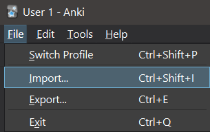

# ULaval-flash-cards

This repository's mission is to share flash cards from courses at University Laval. Thanks to the teachers who accepted to share the content of their course.

- [ULaval-flash-cards](#ulaval-flash-cards)
  - [Why?](#why)
  - [Setup A : I just want some decks](#setup-a--i-just-want-some-decks)
  - [Setup B : I want to contribute](#setup-b--i-want-to-contribute)
  - [Actions](#actions)
  - [How to contribute ?](#how-to-contribute-)

## Why?

Doing flash cards is an efficient learning technique. However, [their creation is time-consuming...](https://andymatuschak.org/files/papers/Seibert%20Hanson%20and%20Brown%20-%202020%20-%20Enhancing%20L2%20learning%20through%20a%20mobile%20assisted%20sp.pdf) Therefore, we've created a place where you can make, access and share flash cards !

## Setup A : I just want some decks
1. Download [Anki](https://apps.ankiweb.net/).
2. Find if we made the deck that you want in `find_a_course.md`.
3. Open the decks' directory and get the deck that you want (it's has a `.apkg` extension).
4. Import the deck that you downloaded :

    
5. Also, don't forget that you can download the app too ([IOS](https://apps.apple.com/us/app/ankimobile-flashcards/id373493387) and [Android](https://play.google.com/store/apps/details?id=com.ichi2.anki&hl=en&gl=us)) and synchronize your decks with an anki account.

## Setup B : I want to contribute

1. Download [VSCode](https://code.visualstudio.com/Download) (or [VSCodium](https://vscodium.com/)).
2. Download [Anki](https://apps.ankiweb.net/).
3. Launch Anki.
4. Download [AnkiConnect](https://ankiweb.net/shared/info/2055492159).
5. Launch VSCode.
6. Download the **Anki for VSCode** extension.
7. Do `Ctrl + shift + p` in VSCode.
8. Select **Anki: Sync Anki**.
9. Go on the Anki's window. You should see a pop-up asking you to connect yourself.
10. Create your Anki account.
11. Download some VSCode's extensions (for productivity purpose):
   - :star2: [docs-markdown](https://marketplace.visualstudio.com/items?itemName=docsmsft.docs-markdown)
   - :star2: [Markdown All in One](https://open-vsx.org/extension/yzhang/markdown-all-in-one)
     - Set `"markdown.extension.orderedList.marker": "ordered",` in your settings of VSCode.
   - :star2: [Paste Image](https://open-vsx.org/extension/mushan/vscode-paste-image)
     - Set `"pasteImage.path": "${currentFileDir}/attachment"` in your settings of VSCode.

## Actions

Now, you're all set! What can you do?

- Create a deck :
  1. Do `Ctrl + Shift + P`
  2. Select Anki: send to own deck.
- Paste an image : `Ctrl + Alt + V`. From `pasteImage`
- Format tables : `Alt + Shift + F` and `Ctrl + Shift + I` on Linux. From `Markdown All in One`
- Markdown options : `Alt + M`. From `docs-markdown`

## How to contribute ?

Everyone is welcome to participate in this repository. If you do
want to participate, you'll want to follow the steps describe in the
[setup](#setup) section. After those steps you'll need to clone the repository.

```bash
git clone https://github.com/ulaval-flash-cards/ulaval-anki-decks.git
```

Keep in mind that you can also propose modifications in pull requests :


